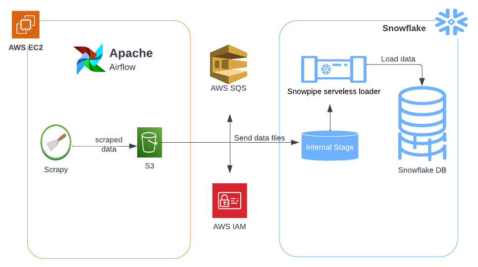
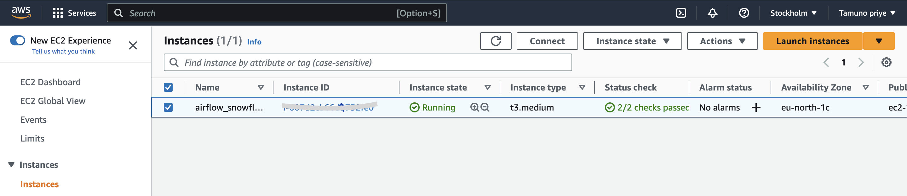
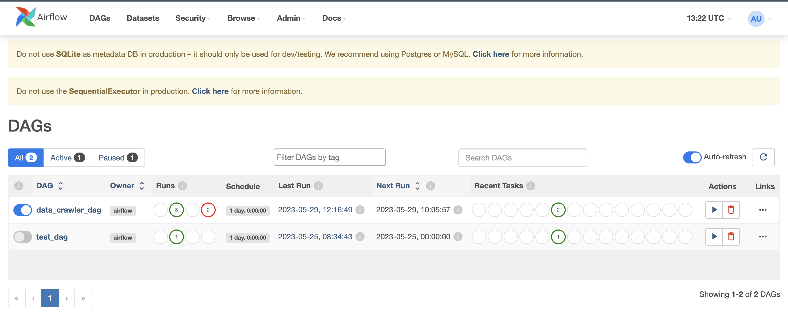
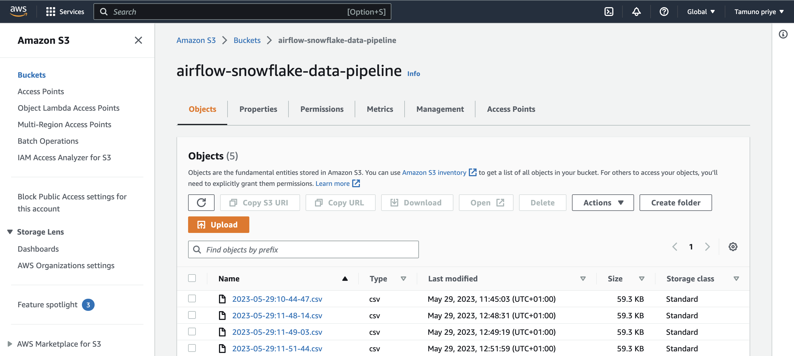
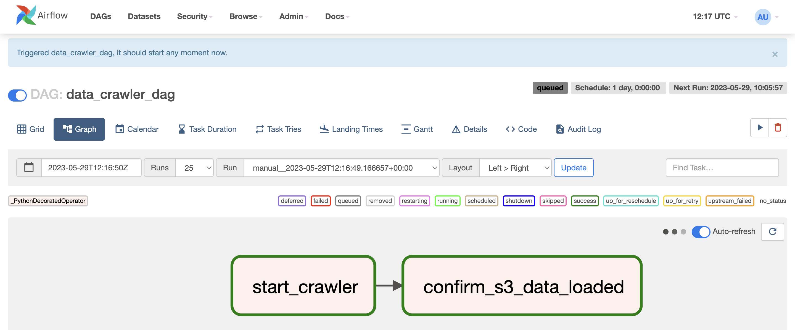
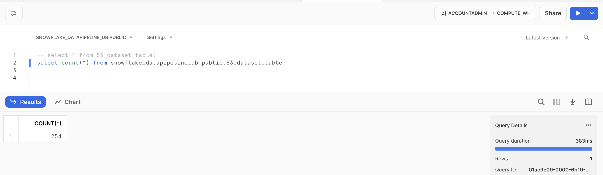

# Data Pipeline Ochestration using Airflow, AWS, and Snowflake
Introducing a Data Pipeline Project that integrates Airflow for Data Orchestration  

### Technologies used
- <b>Apache Airflow</b>: Apache Airflow is an open-source platform for authoring, scheduling and monitoring data and computing workflows. For this project it was used to manage data extraction and transformation process  
- <b>Snowflake</b>: This is a cloud-based data warehousing platform for data storage and analytics purpose. For this project it was used to query datasets loaded automatically from S3  
- <b>Snowpipe</b>:   Snowpipe is a serverless data ingestion service offered by Snowflake, designed to simplify the process of loading data into Snowflake data warehouses. For this project it was used to automatically load data into snowflake table from stage environment.  
- <b>AWS EC2</b> : This is a cloud-based computing service that allows users to quickly launch virtual servers and manage cookies, security, and networking from an easy-to-use dashboard. It was used to host Airflow server for this project.  
- <b>AWS S3</b>: This is a highly scalable object storage service that stores data as objects within buckets. It is commonly used to store and distribute large media files, data backups and static website files. For this project it is used to store data scraped from target website.   
- <b>AWS SQS</b>: This is a message queuing service. It exchanges and stores messages between software components. The service adds the messages in a queue. Users or services pick up the messages from the queue. Once processed the messages gets deleted from the queue. In this project it was used to receive notifications from S3 to an SQS queue to be read by the Snowflake server.   

## Architecture

 

### Languages used
- Python
  

### Datasets
Data was scraped from <a href="https://rewardsforjustice.net/index/?jsf=jet-engine:rewards-grid&tax=crime-category:1070%2C1071%2C1073%2C1072%2C1074">this website </a> using Scrapy.
The website does not provide a public API, hence it was reverse engineered to get the endpoint. Postman was then used to analyze endpoint   

### Getting Started
1. Create EC2 Instance (AWS Ubuntu Server) with at least 4gb RAM as requested by airflow installation requirements - preferable t3.medium 
  
    
2. Install Airflow and other libraries on ec2 Instance. Use commands <a href="https://github.com/priye-1/airflow_data_pipeline/blob/master/ubuntu_commands.sh">here</a> to install dependencies and start airflow server. Clone dags from this repository into your ubuntu directory using git. This will allow you to access the scraper and dag code on your server. Airflow UI can then be accessed using this url format - `http://<public dns address>:8080` 
 

3. Create a snowflake account <a href="https://signup.snowflake.com/">here</a> , also create database, staging environment for incoming files on snowflake, table and pipe to copy data from stage to snowflakes table. Data pipelines can leverage Snowpipe to continously load micro-batches of data into tables for automated tasks. Follow commands <a href="https://github.com/priye-1/airflow_data_pipeline/blob/master/snowflakes_queries.sql">here</a> to create database, tables, etc.
  

4. Create S3 Bucket and IAM role to enable access to s3 from any instance, take note of the AWS key and secret key  
  

5. Set up AWS SQS for all bucket create operations  To enable the bucket to notify Snowpipe when new data arrives. This can be done by executing the query “show pipes;” in snowflakes worksheet, copying the notification_channel(ARN) value from the newly created pipe, and pasting it into the AWS SQS.
  

6. Trigger dag manually from the UI and access Snowflake worksheet to preview data, with time the number of rows increases if airflow task is set to run on a schedule. 

 

 

#### Pipeline Flow
start Airflow server-> Trigger data crawler Dag -> Crawler starts -> loads data into s3 ->   snowpipe loads data into table from s3   

#### Necessary Files
1. Ubuntu commands for Airflow setup can be found <a href="https://github.com/priye-1/airflow_data_pipeline/blob/master/ubuntu_commands.sh">here</a>
2. Airflow and scrapy code can be found  <a href="https://github.com/priye-1/airflow_data_pipeline/tree/master/dags">here</a> This should run in your environment if set up correctly
3. Snowflake queries can be found <a href="https://github.com/priye-1/airflow_data_pipeline/blob/master/snowflakes_queries.sql">here</a>

### References
<li><a href="https://airflow.apache.org/docs/apache-airflow/1.10.4/_modules/airflow/hooks/S3_hook.html#S3Hook.check_for_key">Airflow S3_hook Source code</a></li>
<li><a href="https://towardsdatascience.com/apache-airflow-for-data-science-how-to-upload-files-to-amazon-s3-5bdf6fcb1cea">Creating connection id in Airflow</a></li>
<li><a href="https://docs.snowflake.com/en/user-guide/getting-started-tutorial-log-in">Setting up SnowSQL</a></li>
<li><a href="https://docs.snowflake.com/en/user-guide/data-load-snowpipe-auto-s3#step-2-create-the-iam-role-in-aws">Automating Snowpipe for amazon S3 </a></li>
<li><a href="https://medium.com/snowflake/how-to-automate-snowpipe-to-load-data-from-aws-s3-to-snowflake-1df7fcfc7a85">How to automate SnowPipe To Load Data From AWS S3 To Snowflake </a></li>
<li><a href="https://calogica.com/sql/snowflake/2019/04/04/snowpipes.html#8-create-the-snowpipe">Setting up a data pipeline using Snowflake’s Snowpipes in ‘10 Easy Steps</a></li>
<li><a href="https://docs.astronomer.io/learn/airflow-passing-data-between-tasks?tab=taskflow#example-dag-using-xcoms">Pass data between Airflow tasks</a></li>
<li><a href="https://scrapeops.io/python-scrapy-playbook/scrapy-save-aws-s3/">Scrapy To AWS S3</a></li>
<li><a href="https://docs.scrapy.org/en/latest/topics/practices.html#run-scrapy-from-a-script">Run Scrapy from a Script</a></li>
<li><a href="https://docs.snowflake.com/en/sql-reference/functions/copy_history">Snowflakes Copy History</a></li>
